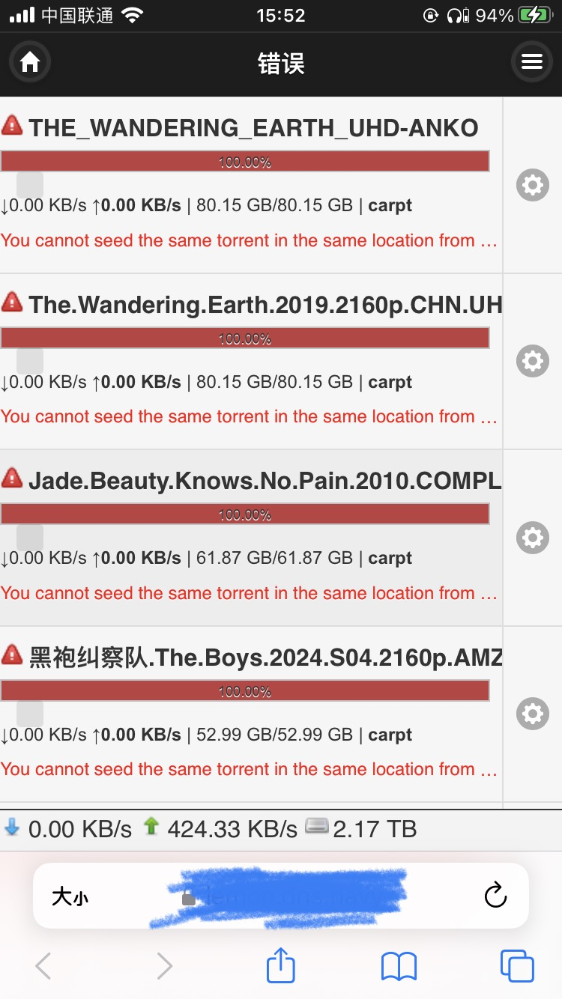
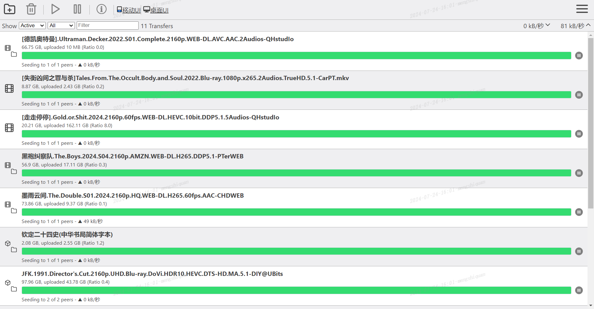
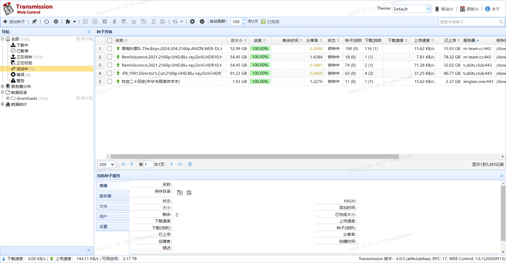

# transmission_web_ui
这是一个针对Transmission的WEBUI项目，包括桌面UI、移动UI和原版UI。桌面UI、移动UI源自 https://github.com/ronggang/transmission-web-control； 原版UI源自Transmission官方Github https://github.com/transmission/transmission 的web部分。

本项目旨在增强Transmission的移动端操作能力，主要针对PT站保种使用。之前RONGGANG大神的项目核心更新还维持在6年前，而且移动端部分相对简单。故有对其进行优化的想法。

目前主要针对移动UI进行了一些优化（自己有较多手机传种的需求）:
- [x] 修改种子显示信息
  - 添加"已上传量"
  - 显示tracks对应的PT站名称
  - 加粗"上传速度"
  - 显示tranck error信息
- [x] 添加下载任务增加从本地上传种子功能（之前移动UI仅有通过磁性链接上传的功能）

|||
|---|---|
|||

针对原版UI的优化：
- [x] 添加跳转至桌面UI和移动UI的链接



目前桌面UI还是维持RONGGANG大神的原始UI，后期也会逐步进行更新优化


---
这是一个新开始的小项目，昨天（2024/7/23）花了晚上的时间了解了ronggang原有代码的执行逻辑，并进行了细微的改动。目前主要供自用，后期将逐步优化，甚至可能通过vue进行重构，并加入部分数据分析功能（甚至会给出刷流建议，发挥自己本职工作的技能）。

以下为短期计划更新（早期计划每周进行简单更新）：
- [ ] 单个种子限流功能
- [ ] 针对特定PT站进行限流功能
- [ ] 针对单个种子进行快速校验功能
- [ ] transmisson 制作种子功能（指的是针对已下载的文件，制作种子供其他PT站发布用），针对主流PT站实现一键制种的功能
- [ ] 批量修改tracks功能

……

有新需求可以提issue，会尽力实现。

---
## 安装方法
docker环境

分享一下我使用的docker-compose.yml
```yml
version: "2.1"

services:
  transmission:
    image: linuxserver/transmission:latest
    container_name: transmission
    environment:
      - PUID=1000 ## 按需设置
      - PGID=1000 ## 按需设置，两者都为0为root账号
      - TZ=Asia/Shanghai
      - TRANSMISSION_WEB_HOME=/web_ui ## 使用transmission web ui得设置这个环境变量
      - USER=your_user_name
      - PASS=your_pass_word
    volumes:
      - ./web_ui:/web_ui
      - ./config:/config
      - ../../downloads:/downloads
      - ./watch:/watch
    ports:
      - 9091:9091 ## transmission web界面访问的端口
      - 51413:51413  ## 上传下载端口
      - 51413:51413/udp  ## 上传下载端口
    restart: unless-stopped
```

1. 下载github项目
2. 解压到你设置的web_ui路径即可